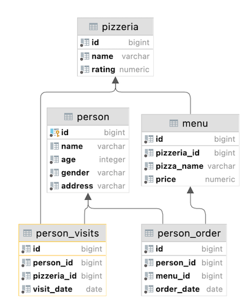

# SQL_beginner.Day01
Day 00 of the PostgreSQL Intensive at School21 - getting the data you need based on set constructs and simple JOINs.
# README



## **Exercise 00**

**Exercise 00 - Let’s make UNION dance**

Please write a SQL statement which returns menu’s identifier and pizza names from `menu` table and person’s identifier and person name from `person` table in one global list (with column names as presented on a sample below) ordered by object_id and then by object_name columns.

| object_id | object_name |
| --- | --- |
| 1 | Anna |
| 1 | cheese pizza |
| ... | ... |

**Exercise 01 - UNION dance with subquery**

Please modify a SQL statement from “exercise 00” by removing the object_id column. Then change ordering by object_name for part of data from the `person` table and then from `menu` table (like presented on a sample below). Please save duplicates!

object_name

---

Andrey

---

Anna

---

...

---

cheese pizza

---

cheese pizza

---

...

---

**Exercise 02 - Duplicates or not duplicates**

Please write a SQL statement which returns unique pizza names from the `menu` table and orders by pizza_name column in descending mode. Please pay attention to the Denied section.

**Exercise 03 - “Hidden” Insights**

Please write a SQL statement which returns common rows for attributes order_date, person_id from `person_order` table from one side and visit_date, person_id from `person_visits` table from the other side (please see a sample below). In other words, let’s find identifiers of persons, who visited and ordered some pizza on the same day. Actually, please add ordering by action_date in ascending mode and then by person_id in descending mode.

| action_date | person_id |
| --- | --- |
| 2022-01-01 | 6 |
| 2022-01-01 | 2 |
| 2022-01-01 | 1 |
| 2022-01-03 | 7 |
| 2022-01-04 | 3 |
| ... | ... |

**Exercise 04 - Difference? Yep, let's find the difference between multisets.**

Please write a SQL statement which returns a difference (minus) of person_id column values with saving duplicates between `person_order` table and `person_visits` table for order_date and visit_date are for 7th of January of 2022

**Exercise 05 - Did you hear about Cartesian Product?**

Please write a SQL statement which returns all possible combinations between `person` and `pizzeria` tables and please set ordering by person identifier and then by pizzeria identifier columns. Please take a look at the result sample below. Please be aware column's names can be different for you.

| person.id | person.name | age | gender | address | pizzeria.id | pizzeria.name | rating |
| --- | --- | --- | --- | --- | --- | --- | --- |
| 1 | Anna | 16 | female | Moscow | 1 | Pizza Hut | 4.6 |
| 1 | Anna | 16 | female | Moscow | 2 | Dominos | 4.3 |
| ... | ... | ... | ... | ... | ... | ... | ... |

**Exercise 06 - Lets see on “Hidden” Insights**

Let's return our mind back to exercise #03 and change our SQL statement to return person names instead of person identifiers and change ordering by action_date in ascending mode and then by person_name in descending mode. Please take a look at a data sample below.

| action_date | person_name |
| --- | --- |
| 2022-01-01 | Irina |
| 2022-01-01 | Anna |
| 2022-01-01 | Andrey |
| ... | ... |

**Exercise 07 - Just make a JOIN**

Please write a SQL statement which returns the date of order from the `person_order` table and corresponding person name (name and age are formatted as in the data sample below) which made an order from the `person` table. Add a sort by both columns in ascending mode.

| order_date | person_information |
| --- | --- |
| 2022-01-01 | Andrey (age:21) |
| 2022-01-01 | Andrey (age:21) |
| 2022-01-01 | Anna (age:16) |
| ... | ... |

**Exercise 08 - Migrate JOIN to NATURAL JOIN**

Please rewrite a SQL statement from exercise #07 by using NATURAL JOIN construction. The result must be the same like for exercise #07.

**Exercise 09 - IN versus EXISTS**

Please write 2 SQL statements which return a list of pizzerias names which have not been visited by persons by using IN for 1st one and EXISTS for the 2nd one.

**Exercise 10 - Global JOIN**

Please write a SQL statement which returns a list of the person names which made an order for pizza in the corresponding pizzeria. The sample result (with named columns) is provided below and yes ... please make ordering by 3 columns in ascending mode.

| person_name | pizza_name | pizzeria_name |
| --- | --- | --- |
| Andrey | cheese pizza | Dominos |
| Andrey | mushroom pizza | Dominos |
| Anna | cheese pizza | Pizza Hut |
| ... | ... | ... |

Let’s make our first task. Please make a select statement which returns all person's names and person's ages from the city ‘Kazan’.

## **Exercise 01**

Please make a select statement which returns names , ages for all women from the city ‘Kazan’. Yep, and please sort result by name.

## **Exercise 02**

Please make 2 syntax different select statements which return a list of pizzerias (pizzeria name and rating) with rating between 3.5 and 5 points (including limit points) and ordered by pizzeria rating.

- the 1st select statement must contain comparison signs (<=, >=)
- the 2nd select statement must contain `BETWEEN` keyword

## **Exercise 03**

Please make a select statement which returns the person's identifiers (without duplication) who visited pizzerias in a period from 6th of January 2022 to 9th of January 2022 (including all days) or visited pizzeria with identifier 2. Also include ordering clause by person identifier in descending mode.

## **Exercise 04**

Please make a select statement which returns one calculated field with name ‘person_information’ in one string like described in the next sample:

`Anna (age:16,gender:'female',address:'Moscow')`

Finally, please add the ordering clause by calculated column in ascending mode. Please pay attention to quote symbols in your formula!

## **Exercise 05**

Please make a select statement which returns person's names (based on internal query in `SELECT` clause) who made orders for the menu with identifiers 13 , 14 and 18 and date of orders should be equal 7th of January 2022. Be aware with "Denied Section" before your work.

Please take a look at the pattern of internal query.

```
SELECT
    (SELECT ... ) AS NAME  -- this is an internal query in a main SELECT clause
FROM ...
WHERE ...

```

## **Exercise 06**

Please use SQL construction from Exercise 05 and add a new calculated column (use column's name ‘check_name’) with a check statement (a pseudo code for this check is presented below) in the `SELECT` clause.

```
if (person_name == 'Denis') then return true
    else return false

```

## **Exercise 07**

Let’s apply data intervals for the `person` table. Please make a SQL statement which returns a person's identifiers, person's names and interval of person’s ages (set a name of a new calculated column as ‘interval_info’) based on pseudo code below.

```
if (age >= 10 and age <= 20) then return 'interval #1'
else if (age > 20 and age < 24) then return 'interval #2'
else return 'interval #3'

```

and yes...please sort a result by ‘interval_info’ column in ascending mode.

## **Exercise 08**

Please make a SQL statement which returns all columns from the `person_order` table with rows whose identifier is an even number. The result have to order by returned identifier.

## **Exercise 09**

Please make a select statement that returns person names and pizzeria names based on the `person_visit` table with date of visit in a period from 07th of January to 09th of January 2022 (including all days) (based on internal query in `FROM` clause) .

Please take a look at the pattern of the final query.

```
SELECT (...) AS person_name ,  -- this is an internal query in a main SELECT clause
        (...) AS pizzeria_name  -- this is an internal query in a main SELECT clause
FROM (SELECT … FROM person_visits WHERE …) AS pv -- this is an internal query in a main FROM clause
ORDER BY ...

```

Please add a ordering clause by person name in ascending mode and by pizzeria name in descending mode
